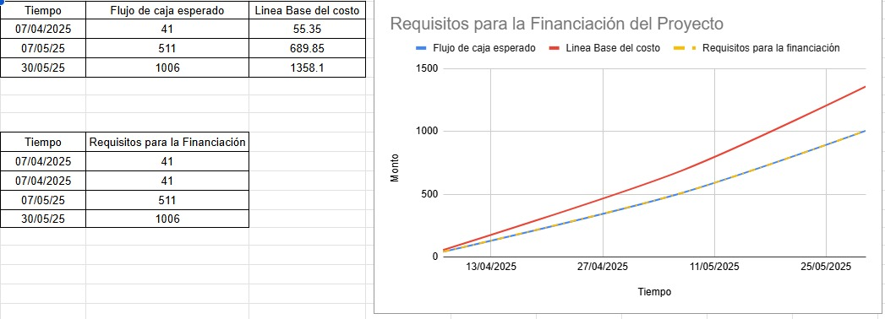

# EDT (Entrada)

	

# Estimación de costos (Entrada)

| **Actividad**                            | **Tiempo** | **Costo** |
| ---------------------------------------- | ---------- | --------- |
| **1.1 Informe de análisis del Mercado**  | 9 días     | S/. 0     |
| 1.1.1 Público Objetivo                   | 5 días     | S/. 0     |
| 1.1.2 Análisis de la competencia         | 4 días     | S/. 0     |
| **2.1 Objetivos de marketing**           | 5 días     | S/. 0     |
| **2.2 Redes sociales seleccionadas**     | 24 días    | S/. 495   |
| 2.2.1 Facebook                           | 4 días     | S/. 120   |
| 2.2.2 Instagram                          | 12 días    | S/. 195   |
| 2.2.3 TikTok                             | 12 días    | S/. 180   |
| **3.1 Identidad visual**                 | 5 días     | S/. 0     |
| 3.1.1 Logo                               | 2 días     | S/. 0     |
| 3.1.2 Plantillas para publicaciones      | 3 días     | S/. 0     |
| 3.1.3 Branding                           | 2 días     | S/. 0     |
| **3.2 Contenido Inicial**                | 4 días     | S/. 470   |
| 3.2.1 Fotografías de productos           | 4 días     | S/. 200   |
| 3.2.2 Videos de montaje o uso de muebles | 4 días     | S/. 270   |
| **4.1 KPIs definidos**                   | 5 días     | S/. 0     |
| **4.2 Herramientas de análisis**         | 2 días     | S/. 0     |

# Análisis de datos (Herramienta)

<iframe
	frameborder='0'
	style='width:100%;height:350px;'
	src='https://viewer.diagrams.net/?tags=%7B%7D&lightbox=1&highlight=0000ff&edit=_blank&layers=1&nav=1&title=LINEA%20BASE%20DE%20COSTO#Uhttps%3A%2F%2Fdrive.google.com%2Fuc%3Fid%3D1mu0flnp65MDRgQj_qvRX5ECDHTbhJJoy%26export%3Ddownload'
></iframe>
 

# Requisitos de financiamiento del proyecto (Salida)

